# T02: DPR --- Còpies de seguretat. Cas pràctic

Document tècnic amb proves de concepte per implementar el pla de còpies
de seguretat del client **"Muntatges i Serveis Tècnics SL"**. S'hi
aplica l'esquema **3-2-1** i es descriuen els procediments tant en
**Windows (Duplicati)** com en **Linux (Duplicity + cron)**.

------------------------------------------------------------------------

## Part 1 --- Còpia de seguretat en Windows amb Duplicati (perfil d'usuari)

**Objectiu:** configurar còpies horàries del perfil d'usuari a un disc
secundari i una còpia diària a les 18:00 cap a Google Drive.

### Procés d'instal·lació i configuració

Durant la instal·lació inicial de Windows es crea una partició
addicional destinada a les còpies de seguretat.

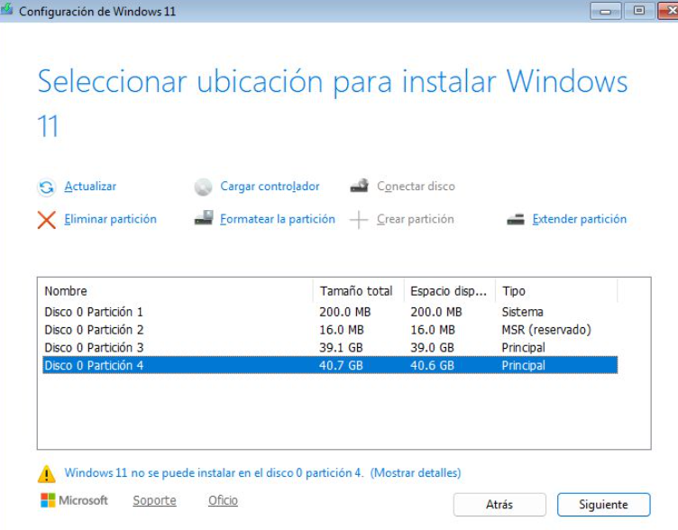

Un cop instal·lat Windows 11, s'acaba l'assistent de configuració i
s'instal·la Google Chrome per facilitar l'accés als serveis en línia,
com ara Google Drive.


Posteriorment s'instal·la **Duplicati**

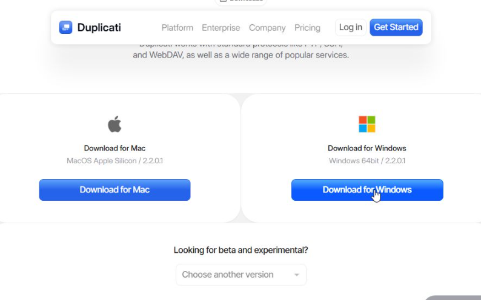

descarregat des de la seva web
oficial.

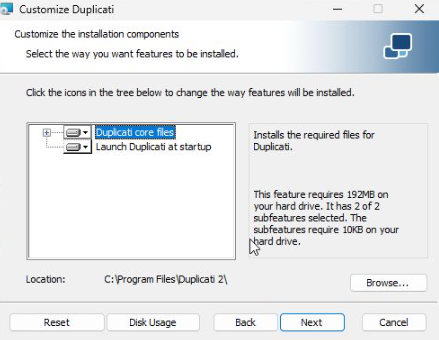

Després de completar la instal·lació, s'accedeix a la
interfície principal per crear un nou treball de còpia.

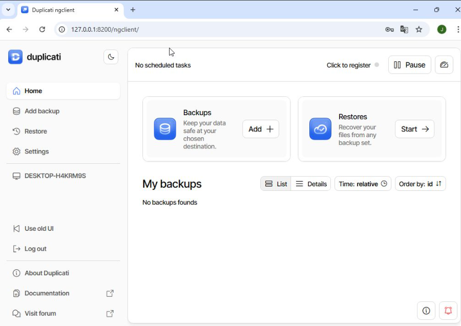

En crear el job, s'escull l'opció *New Backup*

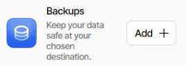

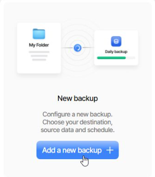

s'estableix una contrasenya del magatzem

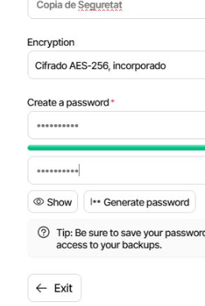

i es configura el destí local a la unitat **D:**

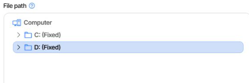


A continuació es trien les carpetes a protegir (per exemple,
*Documents*)

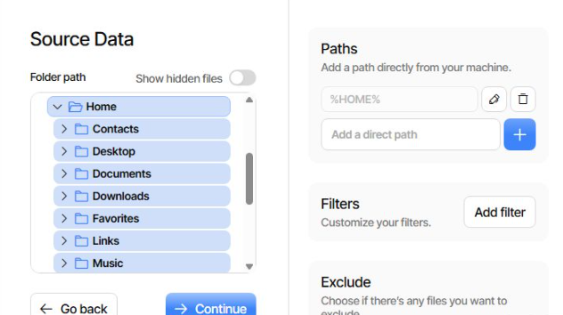


i es defineix una programació horària perquè s'executi
automàticament.

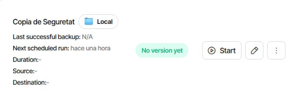

Es revisa el resum i es guarda el treball.

------------------------------------------------------------------------

## Còpia a Google Drive

Es repeteix el procés anterior però seleccionant Google Drive com a
destí.


En un punt, Duplicati sol·licita un **AuthID**.

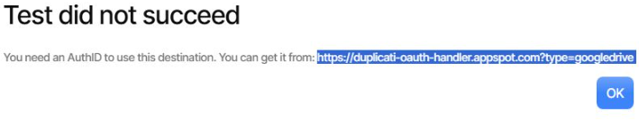


S'obre l'enllaç indicat, es realitza l'inici de sessió amb Google i
s'obté el codi d'autorització, que s'introdueix al camp corresponent de
Duplicati.

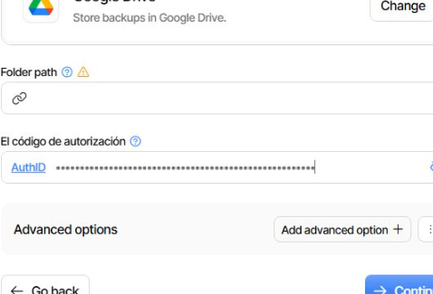

Un cop validat, es defineix la planificació (dia i hora) i es guarda el
treball. Ja queden configurades les dues còpies: local i al núvol.


------------------------------------------------------------------------

## Comprovació del funcionament

Per verificar les còpies:

1.  Es crea un fitxer de prova dins la carpeta *Documents*.

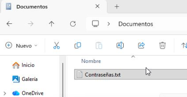

2.  S'executa manualment la còpia de seguretat des de Duplicati.
   
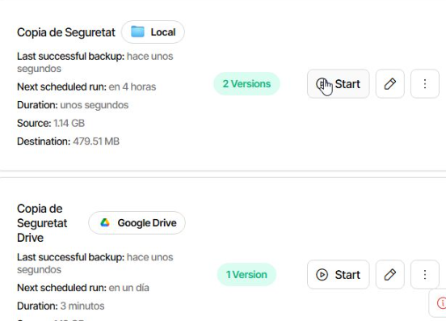
   
3. Esborra el fitxer de *Documents*.

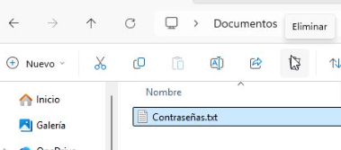

7.  S'obre l'historial de còpies i es recupera el fitxer per assegurar
    que el sistema funciona correctament.

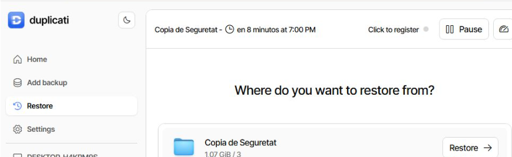

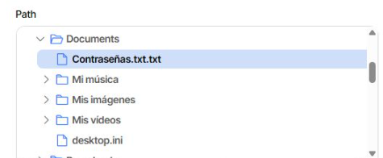

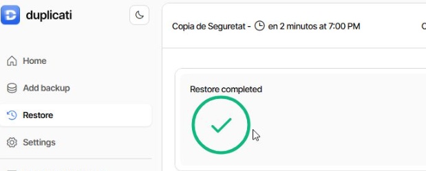
  
------------------------------------------------------------------------


# T02: Còpies de Seguretat a Linux amb Duplicity

Aquest tutorial mostra com configurar còpies de seguretat a Linux utilitzant Ubuntu Server i un disc dur addicional de 10 GB.

---

## 1. Creació de la partició

Creem una nova partició al disc addicional:

```bash
sudo fdisk /dev/sdb
```


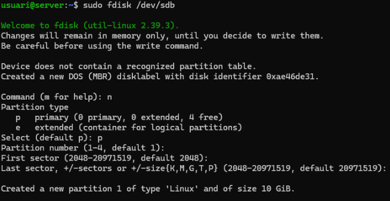

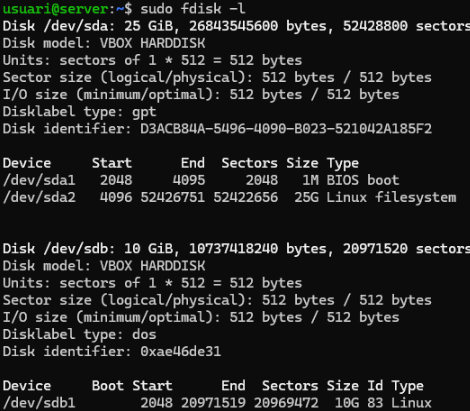


**Passos dins fdisk:**
- `n` per crear una nova partició
- `p` per fer-la primària
- ENTER per acceptar valors per defecte
- `w` per desar els canvis

---

## 2. Format i muntatge

Formategem la partició amb XFS i muntem el disc:

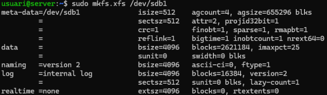


sudo mkdir -p /media/backup

sudo mount /dev/sdb1 /media/backup

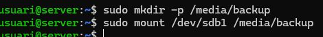

```

---

## 3. Instal·lació de Duplicity

```bash
sudo apt install duplicity
```
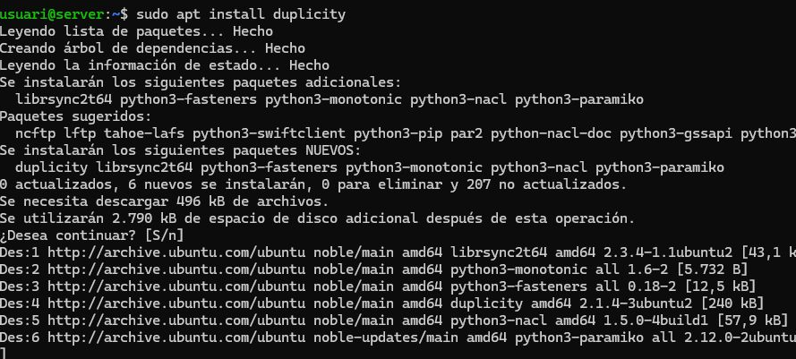

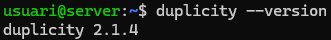
---

## 4. Creació d'usuaris

Creem dos nous usuaris amb el seu directori personal i assignem contrasenya:

```bash
sudo useradd -m -s /bin/bash usuari2
sudo useradd -m -s /bin/bash usuari3
sudo passwd usuari2
sudo passwd usuari3
```

---
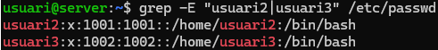

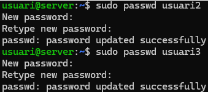

## 5. Creació d'arxius de prova

Generem quatre arxius de 10 MB al directori home de l'usuari principal.

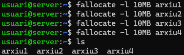

---

## 6. Còpia completa

Fem la còpia de seguretat completa de `/home`:

```bash
sudo duplicity full /home/ file:///media/backup/
```

---


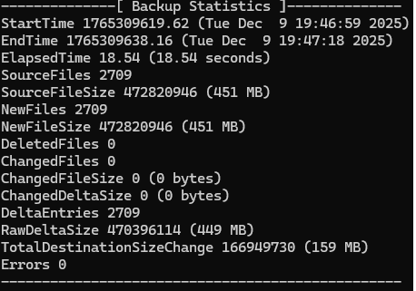

## 7. Restauració de dades

Esborrem els fitxers de prova:

```bash
rm arxiu*
```

I restaurar-los:

```bash
sudo duplicity restore file:///media/backup/ /home/usuari
```

---

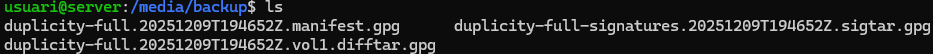

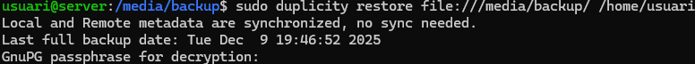

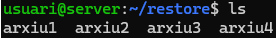

## 8. Còpia incremental

Afegim un nou arxiu de 4 MB i fem una còpia incremental:

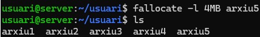


sudo duplicity incremental /home/ file:///media/backup/

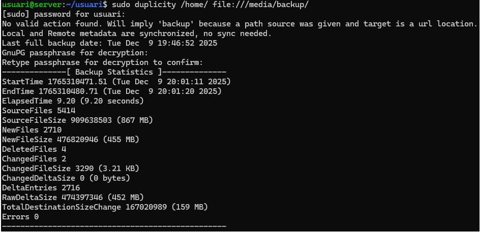


```

---


## 9. Script de còpia automàtica

Desmuntem la unitat:

```bash
sudo umount /media/backup
```


Creem l'script `fullbackup.sh`:


Assignem permisos d'execució:

```bash
sudo chmod +x fullbackup.sh
```
---

## 10. Programació amb CRON

Executar la còpia completa els diumenges a les 23:00:

```bash
sudo crontab -e
```
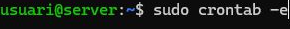

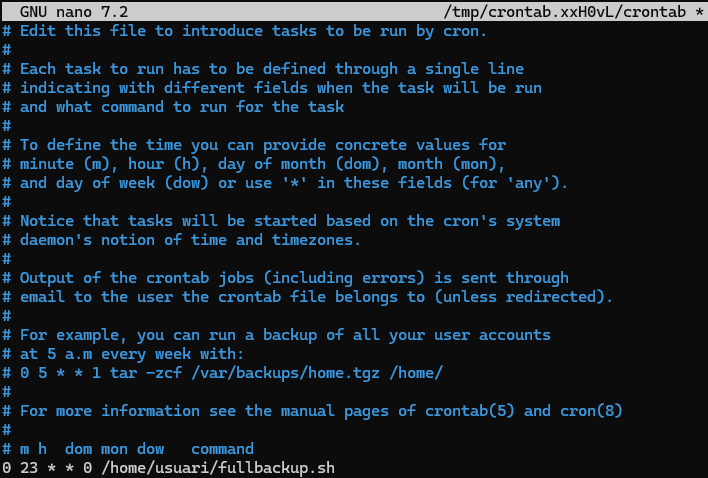
