# **T05: Accés Remot. Connexió via SSH (tasca individual)**  

Primer de tot, crearem dues màquines virtuals: una amb Windows i l’altra amb Ubuntu. Quan entrem a la màquina d’Ubuntu, obrirem el terminal i executarem unes quantes comandes per instal·lar el servei SSH i deixar-lo llest per utilitzar-lo.

Comrpovem que s’ha instalat correctament

la segona interficie la cambiem a host-only

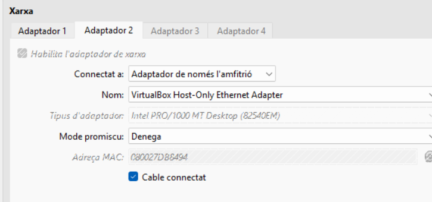

Editem el netplan per assignar la ip a la interficie, i al acabar fem un sudo netplan apply 

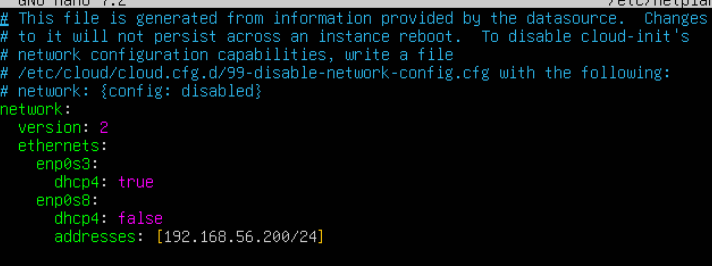

Comprovar si s’ha assignat correctament

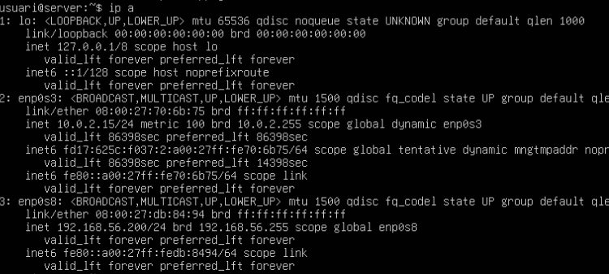

Ara encenem la màquina amb Windows i li afegim una segona interfície de xarxa en mode *Host Only*, així les dues màquines podran comunicar-se sense problemes.

Un cop dins de Windows, anirem a **“Ver conexiones de red”** per revisar la configuració de l’adaptador i assegurar-nos que l’adreça IP s’ha assignat correctament.

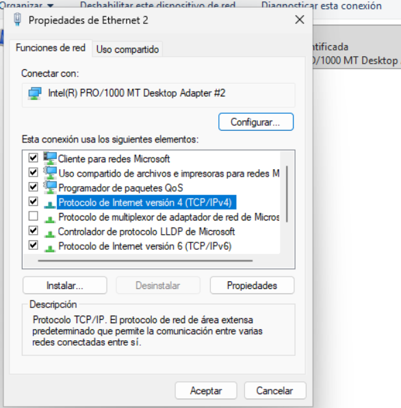

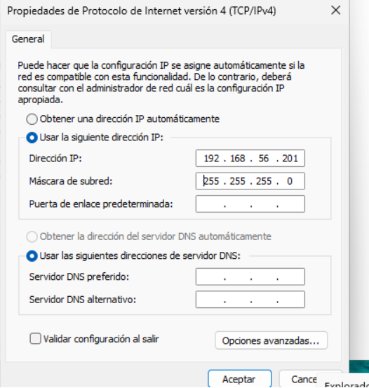

Comprovar que s’ha assignat i es veuen entre elles

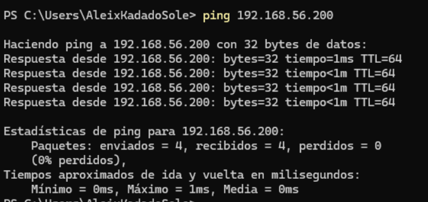

Quan ja tenim totes les passes anteriors enllestides, podem provar de connectar-nos a la màquina Ubuntu des de la terminal de Windows amb la comanda:

**ssh usuari@192.168.56.200**

Com és la primera vegada que ens hi connectem, Windows ens mostrarà un avís de seguretat demanant-nos si volem confiar en la clau pública de la màquina Ubuntu. Simplement acceptem per continuar amb la connexió.

Acceptem i ens connectem

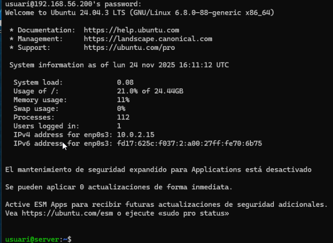

Com es pot veure, podem editar l’arxiu

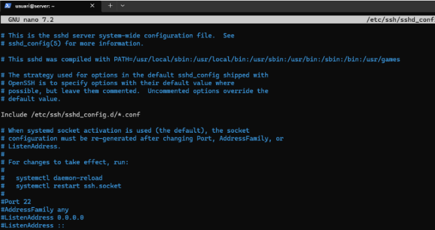

Per tal d’evitar que l’usuari *root* pugui accedir directament per SSH, obrirem l’arxiu **/etc/ssh/sshd\_config** i modificarem les línies corresponents. D’aquesta manera reforcem una mica la seguretat del sistema abans de continuar.

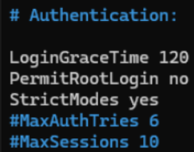

Ara comprovarem que l’usuari *root* només pot iniciar sessió de forma local i no mitjançant SSH. Per fer aquesta verificació, primer haurem de posar o canviar la contrasenya del root amb la comanda següent:

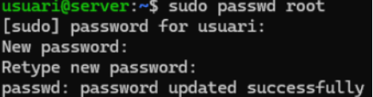

Al intentar fer SSH com a root no ens deixara

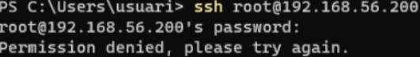

Per garantir que només els usuaris autoritzats es puguin connectar remotament, crearem un nou compte d’usuari.

Per fer-ho, afegirem l’usuari **usuari15** amb la comanda següent:

**sudo useradd \-m \-s /bin/bash usuari15**

A continuació assignarem una contrasenya al nou usuari amb:

**sudo passwd usuari15**

Després, obrirem l’arxiu de configuració d'SSH per indicar quins usuaris tenen permís per connectar-s’hi:

**sudo nano /etc/ssh/sshd\_config**

Un cop dins, afegirem la línia:

**AllowUsers usuari**

D’aquesta manera, només l’usuari especificat podrà iniciar sessió remotament mitjançant SSH.

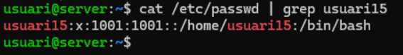

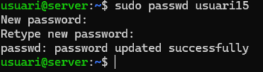

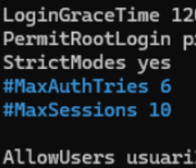

Finalment, reiniciarem el servei SSH perquè tots els canvis que hem fet entrin en funcionament. Ho fem amb la comanda:

**sudo systemctl restart ssh**

Ara, si intentem iniciar sessió amb usuari15 no podrem, mentre que amb l’usuari sí que funciona.

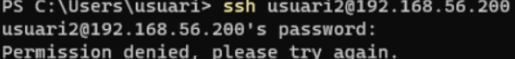

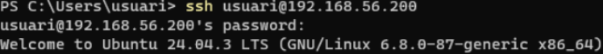

**Creació d’un túnel SSH (Proxy SOCKS)**  
Creem un túnel (pots utilitzar qualsevol port que no utilitzi el sistema):

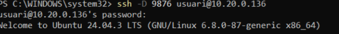

**Configuració del Proxy a Windows**  
 Configurem el proxy anant a:

**Tauler de control → Xarxa i Internet → Opcions d'Internet → Connexions → Configuració de la LAN**

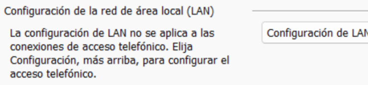

Habilitem Servidor Proxy amb IP local i port 9876\.

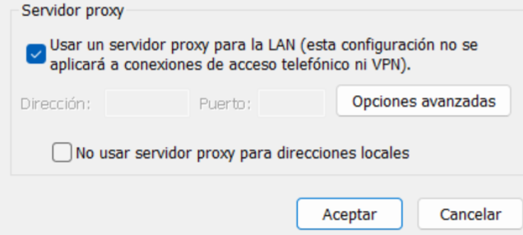

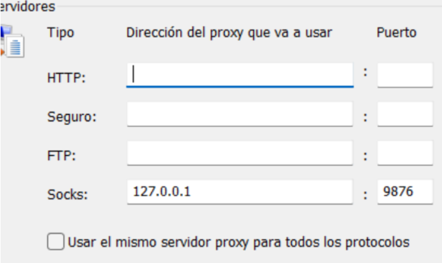

Validar el túnel amb wireshark

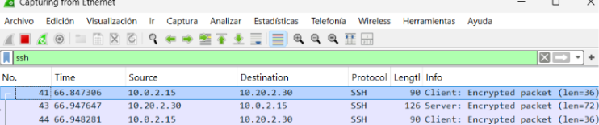

**Configura al teu equip Windows 11 el servidor OpenSSH**  
Entrem a la configuració de Windows 11 i entrem a Sistema.

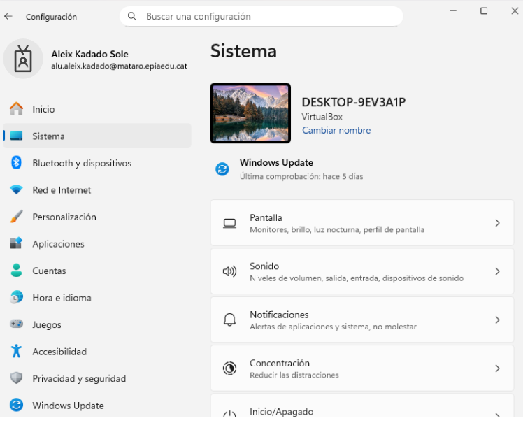

Dins de Sistema hem d’entrar a **“veure característiques”** i permetre que l’aplicació faci canvis al dispositiu.

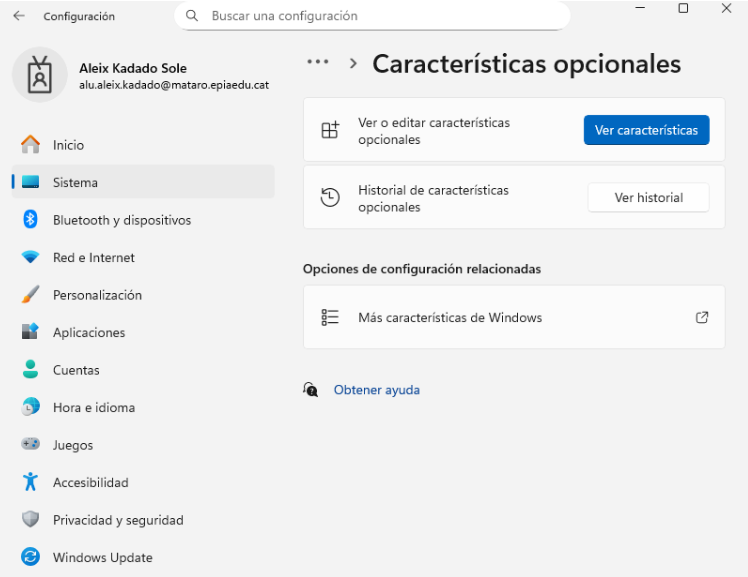

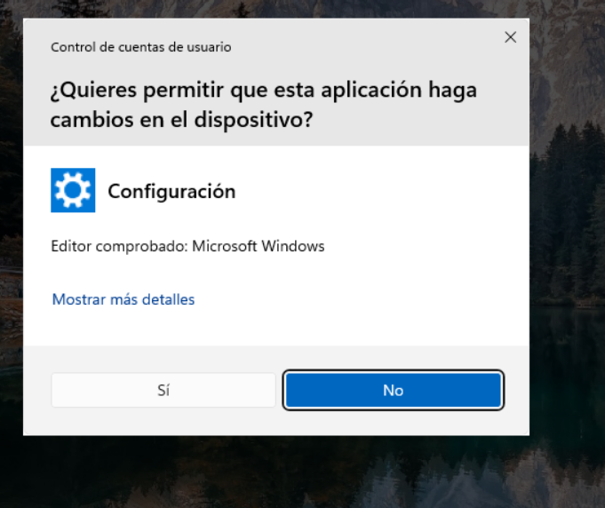

Un cop dins de l’aplicació, és **IMPORTANT** prémer **“veure les característiques disponibles”**.

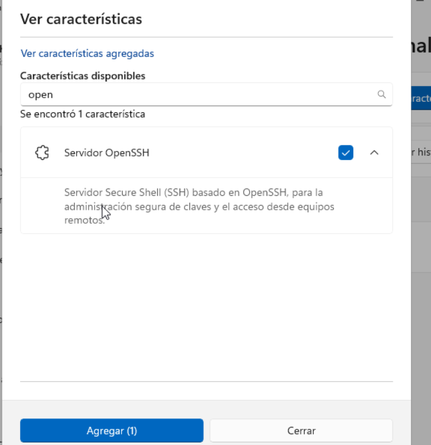

**Connecta’t remotament des de l’equip Linux (en el meu cas és Ubuntu)**  
 Per poder connectar-nos remotament primer hem de fer el següent:

Primer apaguem el tallafoc a Windows 11; busquem **“Tallafoc i protecció de xarxa”**, hi entrem i tot seguit entrem a **“Xarxa pública”** i la desactivem.

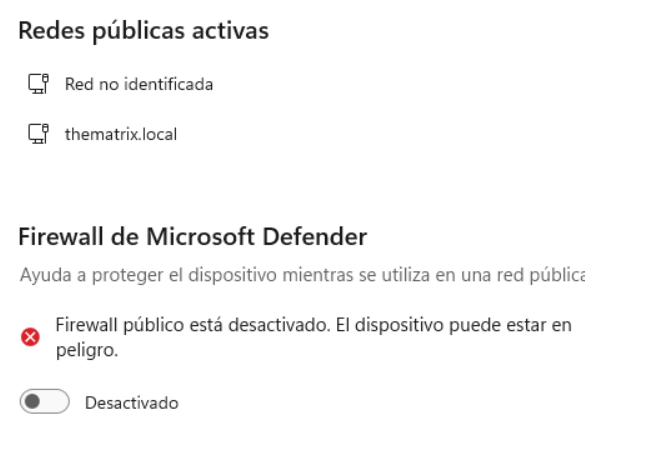

Executem powershell com a administrador

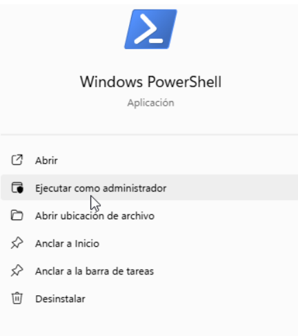

iniciem el servei del servidor ssh

Ipconfig

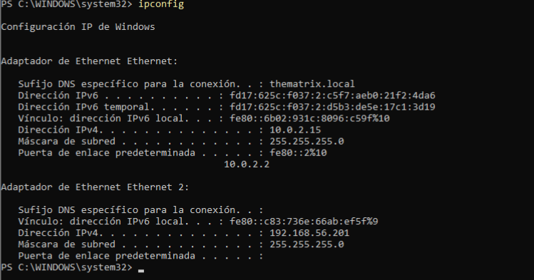

Des de l’equip Ubuntu ens connectarem a l’equip Windows fent servir la IP de la interfície de només host de l’equip Windows.

Abans de res, fem un **ping** des de l’Ubuntu per comprovar que els dos equips es poden veure entre ells. El comandament seria:

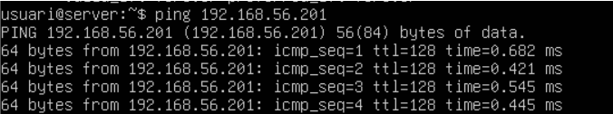

Un cop comprovat que els dos equips es poden veure, ara sí que ens connectarem des de l’equip Ubuntu a l’equip Windows.

Ho farem utilitzant **ssh** seguit del nom de l’equip Windows i de la IP de només host.

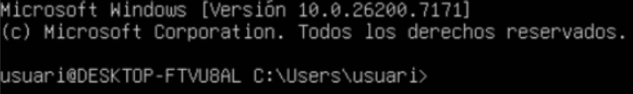

