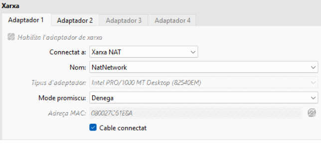
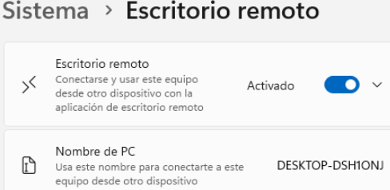
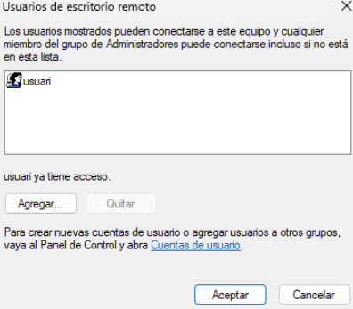
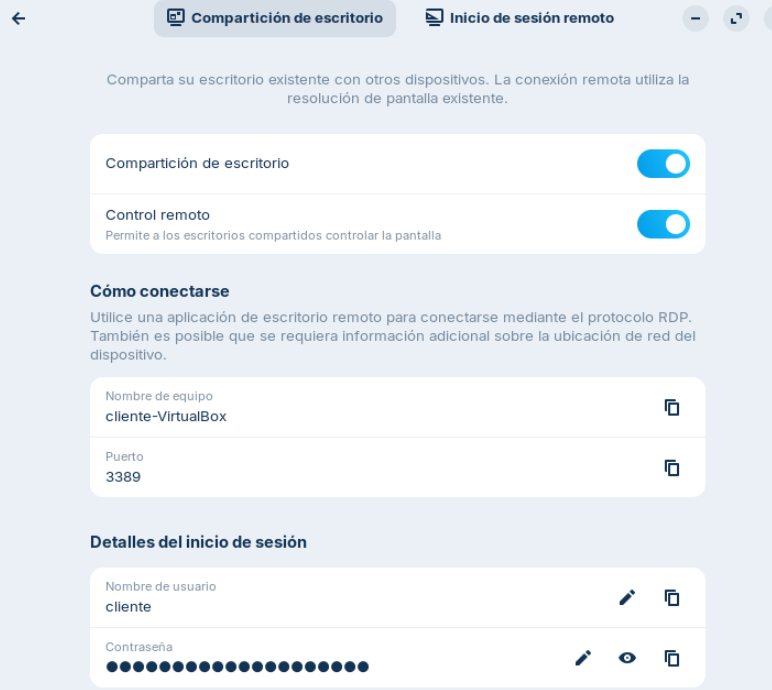
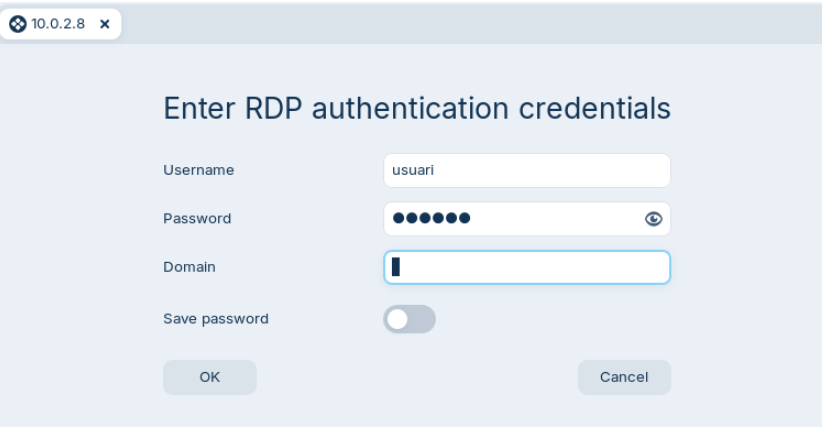
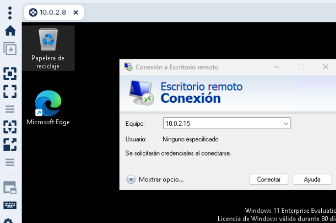
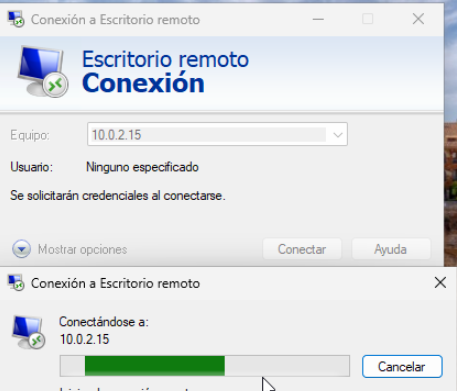
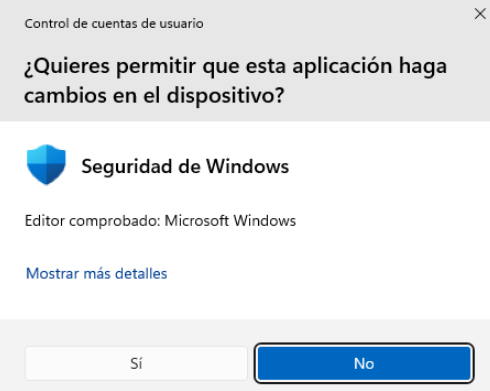

## T06: Accés remot. Escriptori remot (RDP)

### Xarxa

Per tal que les dues màquines virtuals es puguin detectar mútuament i disposin de connexió a internet, he configurat la xarxa en **mode NAT**.

En el meu cas, utilitzo la xarxa NAT perquè les màquines tinguin accés a internet i es puguin comunicar entre elles sense necessitat de realitzar configuracions complexes. Aquesta configuració permet que tant **Windows** com **Zorin OS** disposin de connexió a internet i, alhora, es trobin dins la mateixa xarxa virtual.

---

### Configuració a Windows

A Windows és necessari **activar l’opció d’escriptori remot** perquè un altre dispositiu s’hi pugui connectar. Aquesta opció es troba dins de la configuració del sistema, a l’apartat d’**Escriptori remot**.

Un cop activada, també cal **afegir l’usuari** que tindrà permís per accedir de manera remota al sistema.

En el meu cas he afegit un usuari concret, però cada persona haurà d’utilitzar el seu propi usuari segons la configuració del seu sistema.

Perquè la connexió des de Zorin funcionés correctament, en el meu cas ha estat necessari **desactivar el tallafoc de Windows**.

---

### Configuració a Zorin OS

A Zorin OS he activat la **compartició de l’escriptori** des de la configuració del sistema. També he habilitat l’opció de **control remot** perquè l’altre dispositiu pugui interactuar amb l’escriptori.

El sistema mostra el **nom de l’equip**, el **port** i l’**usuari** amb el qual es permet l’accés remot. A les captures del repositori es poden observar aquests valors tal com els tinc configurats.

---

### Connexió de Zorin a Windows

Des de Zorin OS utilitzo el programa **Remmina** per establir la connexió remota.

Introduïm el nom del dispositiu Windows a la barra de connexió i iniciem la sessió. A continuació, s’introdueixen les **credencials de Windows**.

Després de validar les dades, es mostra l’**escriptori de Windows** dins de Zorin OS.

---

### Connexió de Windows a Zorin

També és possible establir la connexió en el sentit contrari.

Des de Windows s’obre el **client d’escriptori remot** i s’introdueix el nom del dispositiu Zorin. En el meu cas, utilitzo el nom de l’equip tal com apareix a la configuració de Zorin OS.

*

Finalment, s’introdueixen l’**usuari i la contrasenya de Zorin**, i la connexió queda establerta correctament.

